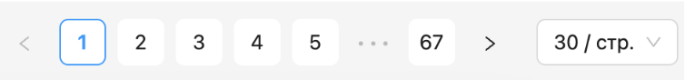

# DevelopmentOfTheAdminPanel

## Техническое задание
Разработать и настроить следующие компоненты:
- Микросервис **API** - функционал REST JSON API;
- Микросервис **frontend** - веб-сервер (например, на базе Nginx), который выдает собранные файлы JS, CSS, HTML на основе React;
- База данных.

## Требования к сервису **API**
1. Должен быть разработан на языке Python с использованием фреймворка FastAPI;
2. Выдача данных только в JSON;
3. Поддержка пагинации с произвольным размером страницы;
4. Хранение и извлечение данных должно быть в БД PostgresSQL либо MongoDB по выбору (в моем случае PostgreSQL);
5. Доступ к БД только с использованием ORM библиотек;
6. Данные в БД можно заполнть тестовами сведениями (~20 записей).

## Требования к сервису **frontend**
1. Должен быть разработан на язвке JavaScript;
2. Должен использоваться React;
3. Должен запрашивать данные с использованием REST API;
4. Необходимо реализовать переключатель страниц (пагинация с изменением страницы);
5. Итоговый бандл должен быть собран в виде статических файлов.

## Требования к **базе данных**
1. Должна быть выбрана БД PostgresSQL или MongoDB(в моем случае первый);
2. 1 таблица со следующими полями: _Фамилия, Имя, Отчество, Курс, Группа, Факультет_.

## Общие требования
1. Весь проект должен запускаться одной командой. Это может быть _bash скрипт, docker-compose_ скрипт или _NPM_ команда.
2. Должна поддерживаться следующая структура директории:
3. В корне расположен README.md и docker-compose.yml;
4. Каждый микросервис, его код, package.json и прочие файлы расположенные в своих директориях (api, frontend, db);
5. Наружу должны быть доступны только 2 HTTP порта - 80 для frontend и 3000 для API;
6. База данных должна обеспечивать _persistence_ в локальную директорию _dump_;
7. Должны быть настроены файлы _.gitignore_ и _.dockerignore_.

## Сценарий использования
Пользователь заходит на главную страницу сайта и видит таблицу с текущими данными студентов. Внизу он видит переключатель
страниц (пагинация с изменением размера страницы). **API** должен поддерживать эту пагинацию и выдавать ровно столько данных,
сколько зарпашивается с фронтенда.

_(пример виджета пагинации)_

